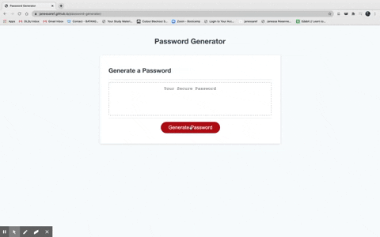
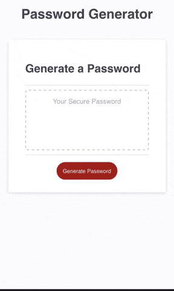
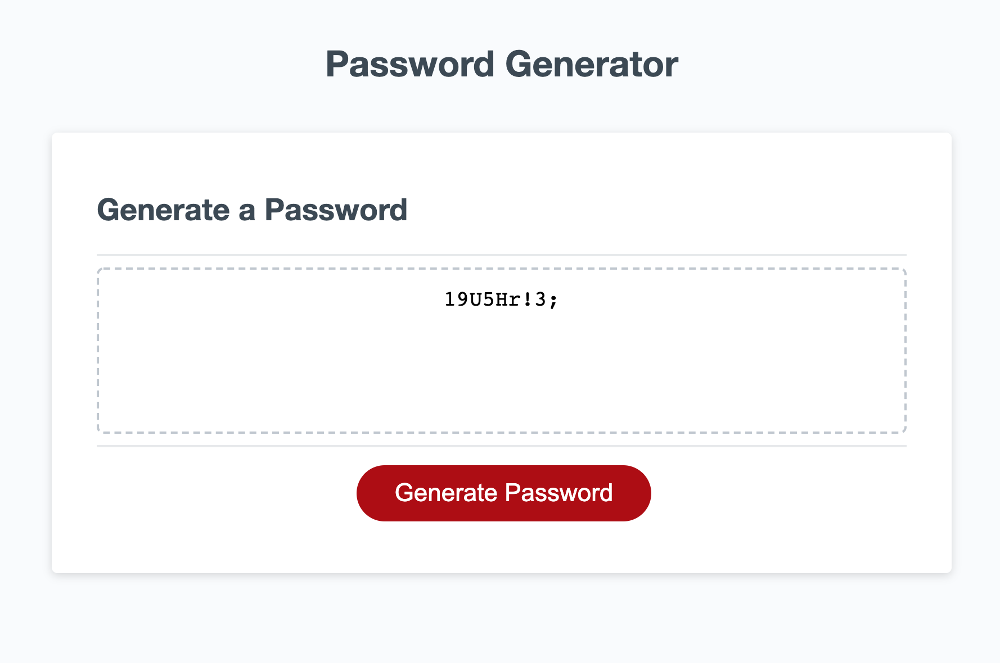

# Random Password Generator

In this project, I've created an application that generates a random password for the user. The user gets to interact with the application by answering a series of questions that will appear and this application will launch a password on the screen based on the user's selected criteria. This application will also ensure that the password being generated matches the selected criteria presenting at least one character type. Each time, the user clicks on the button, it will present a prompt asking the user the number of characters between 8 to 128. When the user puts a valid input, then will be asked if the user would like the following character types: uppercase, lowercase, numeric, and/or symbols in their password. Once, all prompts have been answered by the user, then the password will display inside the box.

For this password generator, it is designed in a way where if the user clicks on the generate password button and puts an invalid input in the prompt, the user does not have to click the generate password button again but instead will have the prompt question repeat. As well as the criteria of character types. If the user cancels all character types, an alert will prompt that the user must select at least one character type and the application will go back to its last checkpoint and will ask the user's preferred password criteria since the user already selected a number of characters which has been previously recorded from the first question. 

This project posed as a challenge for me as a new coder and it laid the foundations of JavaScript. I had to learn how to crawl first before I could run and this tested my adaptability to learn quickly given that this was introduced to me in the last five days. There is still so much to learn and this project pushed me into wanting to conquer JavaScript. It tested my thought process to figure out how to go about and execute as there is no fixed way to get the result.


## Technologies Used

* [HTML](https://developer.mozilla.org/en-US/docs/Web/HTML)
* [CSS](https://developer.mozilla.org/en-US/docs/Web/CSS)
* [Javascript](https://developer.mozilla.org/en-US/docs/Web/JavaScript)

## GIFs of Project






## Image of Project




## Code Snippet

    In this code snippet, this ensures that each character type whichever the user selects in the password criteria will be present and displayed on screen. For each character type, I've separated them into different strings so that no specific character is chosen but is still done randomly.  

```
// Variable that will collect one character per type
  var oneCharacterEach= ""

  // Randomly picks up one character per type
  for(var i = 0; i < 1; i++) {
  var oneUpper = Math.floor(Math.random()*upperStr.length);
   oneCharacterEach += upperStr.charAt(oneUpper);
  }
  for(var j = 0; j < 1; j++) {
  var oneLower = Math.floor(Math.random()*lowerStr.length);
   oneCharacterEach += lowerStr.charAt(oneLower);
  }
  for(var k = 0; k < 1; k++) {
  var oneNumber = Math.floor(Math.random()*numberStr.length);
   oneCharacterEach += numberStr.charAt(oneNumber);
  }
  for(var l = 0; l < 1; l++) {
  var oneSymbol = Math.floor(Math.random()*symbolStr.length);
   oneCharacterEach += symbolStr.charAt(oneSymbol);
  }

```

## Deployed Link

* [See Live Site](https://janessaref.github.io/password-generator/.)


## Authors

* Janessa Reeanne Fong

- [Link to Github](https://github.com/janessaref)
- [Link to LinkedIn](https://www.linkedin.com/in/janessafong)

## License

This project is licensed under the MIT License 

## Acknowledgments

* For the shuffle code, this is where I got inspiration and tips from (https://stackoverflow.com/questions/3943772/how-do-i-shuffle-the-characters-in-a-string-in-javascript)


